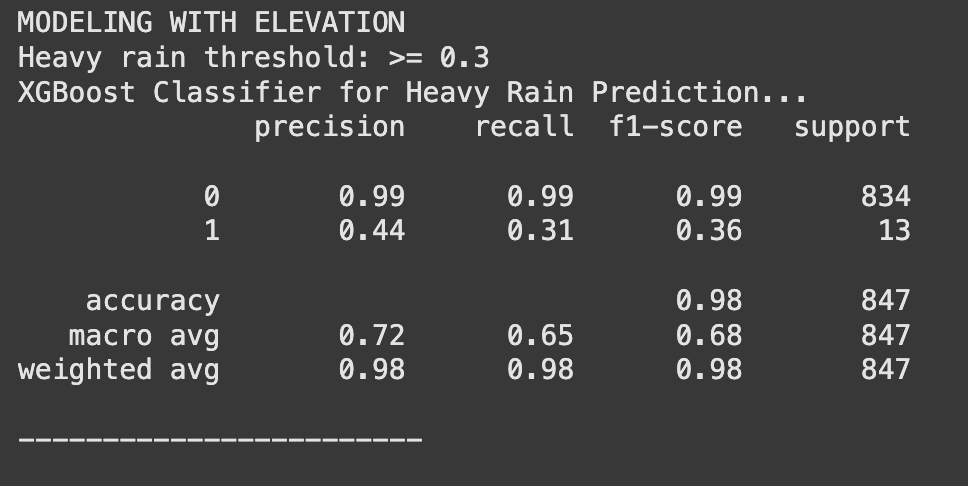
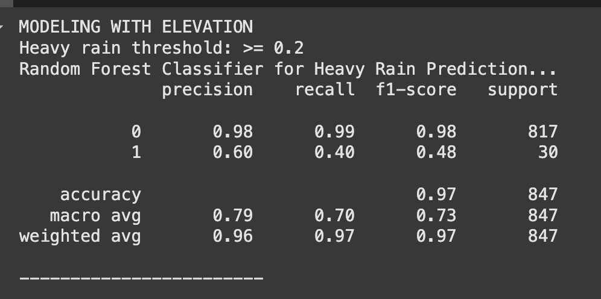
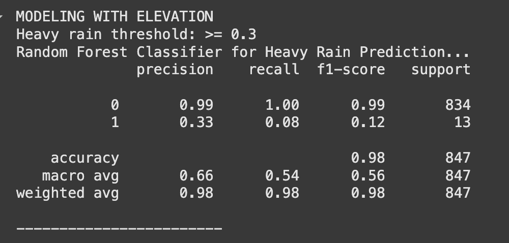
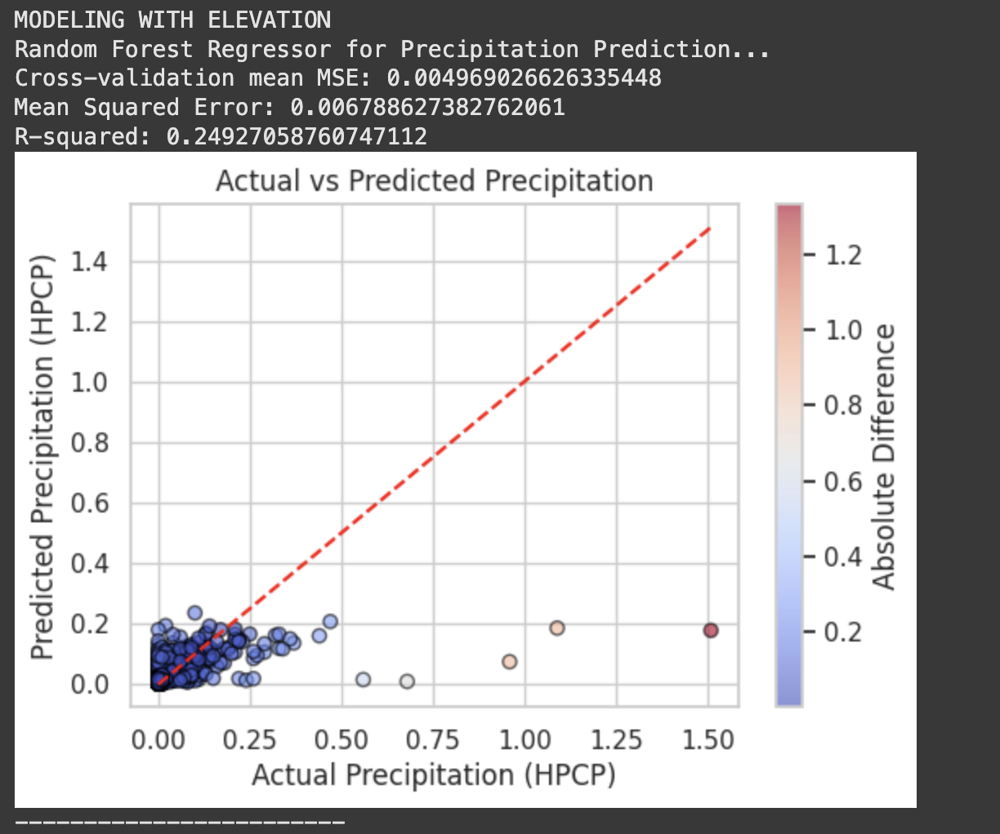
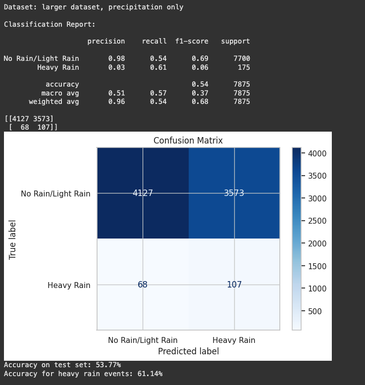
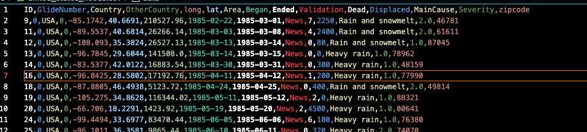
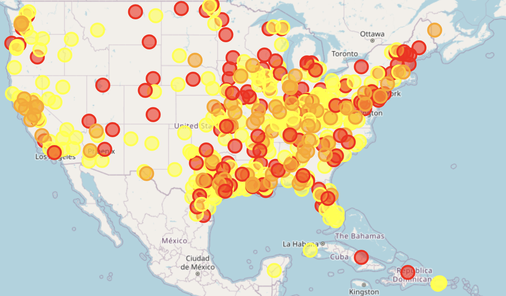
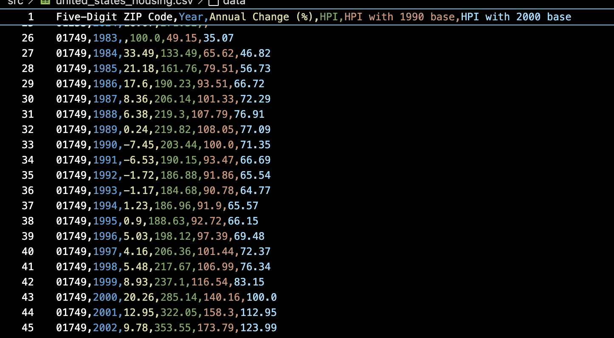

## **Week 2/17 - 2/23**
## 2/21/2025, Melina Garza
- Collecting data and doing an initial analysis of it. Focusing on real-estate sector initially.
- Data found: 
    - financial/stock data: [Yahoo Finance API](https://rapidapi.com/sparior/api/yahoo-finance15)

    - housing data: [Zillow Housing Data](https://www.zillow.com/research/data/)
    - flood data: [Flood events 1985-2016](https://floodobservatory.colorado.edu/Archives/index.html)
    - weather data: [NCEI US Climate Data (1992-2021)](https://www.kaggle.com/datasets/nachiketkamod/weather-dataset-us/data)
- Started programmtic analysis in `src/initial_analysis.py`

## 2/23/2025, Dhwani Sreenivas
- Trying to find data on housing prices over time in different regions of the US, as well as potentially looking at the housing assets that large companies own to be able to predict how their stock prices will be affected
- Data found:
    - housing price index data (1991 - 2024): [Federal Housing Finance Agency](https://www.fhfa.gov/data/hpi/datasets?tab=regional-hpi)
    - investigating company asset data (need demo): [Sovereign Wealth Fund Institute](https://www.swfinstitute.org/fund-rankings/real-estate-company)
- Drew diagram mapping our initial hypothesis/abstract


## **Week 2/24 - 3/2**
## 2/28/2025, Melina Garza
This week's focus is exploring different weather prediction methods and natural disaster prediction methods. Also took a snapshot of the weather data and exploring how to use Google Cloud to run models.

**Weather Data:**

Columns


**Weather Prediction Methods:**

Going to test these out for predicting rainfall (eventually use to predict floods):

1.  ARIMA (AutoRegressive Integrated Moving Average)
    - for short-term predicitons(daily/weekly)

2. LSTM 
    - for long-term rainfall trends/dependencies


**Disaster Prediction Methods:**

TBD

## 3/2/2025, Dhwani Sreenivas
- Focusing on 3 methods of weather forecasting, using rainfall data
- Current kaggle dataset's temporal resolution: daily, spatial resolution: 56950 unique weather stations seen in "precipitation_data_test.png"
- Kaggle dataset: 688 NaNs for precip in first 1000 entries
- Linearly interpolated the data (not best solution)

- Alternative data found:
    - rainfall data: [hourly rainfall 1900-2014](https://www.ncdc.noaa.gov/cdo-web/search?datasetid=PRECIP_HLY#)
    - time based resolution: available in 15 minute increments and hourly increments (hourly sample uploaded)
    - spatial resolution: available by zip codes, cities, states, countries in the US

    - aggregating this data: TBD


## **Week 3/3 - 3/9**
## 3/4/2025, Melina Garza
This week's focus is exploring different weather prediction methods using different models.

**DATA**(for Massachuseets only, eventually will explore other areas): `src/precipitation_data.csv`

**CODE:** `src/ml_climate_precipitation_prediction.ipynb`
- note: ran code in google colab, kept on getting issues locally with libraries

[COLUMNS:](https://www.ncei.noaa.gov/pub/data/cdo/documentation/PRECIP_HLY_documentation.pdf)
`STATION,STATION_NAME,ELEVATION,LATITUDE,LONGITUDE,DATE,HPCP,Measurement Flag,Quality Flag`

**HPCP:** The amount of precipitation recorded at the station for the hour ending at the
time specified for DATE above given in hundredths of inches or tenths of millimeters
depending on user’s specification of standard or metric units. The values 99999 means
the data value is missing. Hours with no precipitation are not shown.

**STEPS**
* **1  Clean the data:  `preprocess_for_ml()`**
* 2   Create plots for each station(for visualiaztion of data, commented out when running entire pipeline): `plot_per_station()`

    - 1.  precipitation over time: raw-time series data
    - 2. monthly precipitation: seasonal trends, cyclical patterns
    - 3. seasonal decomposition: isolates trend, seasonal, and residual components
    - 4. autocorrelation: relationships between past and future values, for models like ARIMA and LSTM

    Example for Blue Hill LCD MA Station:

    
    
    

* **3 Lag Features:** capture temporal dependencies(past values of a variable used as input features to predict future values): `add_lag_features()`

* **4 Modeling**
    - **Regression for Precipitation Prediction**: Decision Trees & XGBoost Models are used to predict the amount of precipitation
    - **Classification**: binary classification to predict whether the precipitaiton exceeds a certain threshold(e.g. 0.3 inches), indicating heavy rain


* **5 RESULTS:**
    1) Without elevation as a feature

        
       
        
    2) With elevation as a feature

          
    

* **6 Analysis/Next Steps**

    **Summary of Results**

     Positive

    - Best Performance: XGBoost achieves the lowest Mean Squared Error (MSE) for both regression tasks, outperforming Decision Trees.
    - High Accuracy in Classification: The classification model shows very high overall accuracy (~98%). However, this is misleading due to class imbalance. The model performs well on predicting the majority class (no heavy rain) but struggles with the minority class (heavy rain).

    Negative

    - Elevation: Adding elevation data doesn’t significantly improve the model. In fact, it slightly worsens the performance of the Decision Tree model.
    - Heavy Rain Prediction Performance:
        - Low Recall Without Elevation: Recall for heavy rain (class 1) is very low (~8%), meaning the model misses most heavy rain events. This is a critical issue for practical prediction. Precision for class 1 is also low (~31%), suggesting that when the model predicts heavy rain, it is often incorrect.
        - Low Recall With Elevation: The addition of elevation does not significantly improve the recall for heavy rain, and the model still fails to identify most heavy rain events.
        

    **Next Steps**

    Address Class Imbalance:

    - **Resampling**: Use SMOTE or random oversampling to balance the training set by increasing heavy rain examples, helping the model better learn the minority class.
    - **Class Weights**: Adjust XGBoost’s `scale_pos_weight` parameter to give more importance to the minority class (heavy rain).
    - **Threshold Adjustment**: Lower the classification threshold for heavy rain to improve recall, at the cost of higher false positives.

    More Modeling Techniques:

    - **Neural Networks**: Try deep learning models like (multi-layer perceptrons) MLPs or LSTMs to capture complex temporal patterns in precipitation data.
    - **Ensemble Methods**: Explore Random Forests or LightGBM for more robust, accurate models that can capture complex relationships.


## **Week 3/10 - 3/16**
## 3/11/2025, Melina Garza

Trying to improve precipitation prediction methods. Tried the following:

Code: added to `src/ml_climate_precipitation_prediction.ipynb`

\
**Resampling: SMOTE(Synthetic Minority Over-sampling Technique)** for classification XGBoost

- Code: `classify_heavy_rain_xgb()`

- Results:
  
  - Slight decrease in precision, but large improvement in recall. Will consider to use in future improvements.

**Class weights** for classification XGBoost

- Code: `classify_heavy_rain_xgb()`

- Results:

    -   Huge decrease in precision and huge increase in recall, meaning too many false positives(correctly identifying more rain events, but falsely predicting more non-heavy rain events). Not desirable.

\
**Ensemble Methods: Random Forest Classifier** 

- Code: added function `classify_heavy_rain_random_forest()` 

- Results:
    - Without optimized parameters
        - threshold: 0.3  
        - Similar to XGBoost results, needs improvement in both precision and recall
    - Used `GridSearchCV()` to find the best parameters:
        ```
        Random Forests for Heavy Rain Prediction...
        Best hyperparameters: {'max_depth': 10, 'min_samples_leaf': 2, 'min_samples_split': 10, 'n_estimators': 100}
        ```
 
    - With optimized parameters
         - threshold: 0.3  
         - Better balance between recall and precision, but they both need to be much higher.


    - Overall: not much improvement in precision for minority class(predicting heavy rain) but acheived better balance between precision and recall compared to XGBoost.


\
**Random Forest Regressor: predicting actual continuous HPCP value**
- Code: added function `precipitation_random_forest_regressor()` 

- Results
    - Best hyperparameters found using `RandomizedSearchCV`: ```{'n_estimators': 200, 'min_samples_split': 5, 'min_samples_leaf': 1, 'max_features': 'sqrt', 'max_depth': 10, 'bootstrap': True}```
    - 

    - Next steps: try to improve the R-squared value, seems to struggle to predict outliers.


## **Week 3/17 - 3/23**

## 3/22 - Melina
## **Testing Previous Methods with New Combined Data**
**Finding additional dataset**
- Find another dataset, add more features like temp., humidity, wind speed, etc.
- Use: https://www.ncdc.noaa.gov/cdo-web/ to find data(site has been unresponsive lately)
- Found normals hourly dataset for two MA stations in 2010(couldn't get more years nor more stations): `src/2010_weather_MA.csv`
- Combined overlapping data from: `src/2010_weather_MA.csv` and `src/precipitation_data.csv` into `combined_weather_precipitation.csv`
    - **New columns:([documentation](https://www.ncei.noaa.gov/data/normals-hourly/doc/NORMAL_HLY_documentation.pdf))** 
    HLY-CLOD-PCTCLR(Clouds clear percentage),HLY-CLOD-PCTOVC(Clouds overcast percentage),HLY-DEWP-NORMAL(Dew point mean),HLY-HIDX-NORMAL(Heat index mean),HLY-TEMP-NORMAL(Temperature mean),HLY-WIND-AVGSP(Average wind speed),HLY-WIND-VCTDIR(Mean wind vector direction),HLY-WIND-VCTSPD(Mean wind vector magnitude)


Notes: 
- Dataset Size: Reduced by ~89% (7,875 to 847 samples).
- Also added  `KNNImputer(n_neighbors=5)` to handle missing values using k-nearest neighbors
### XGBoost 
Results
- heavy rain(0.3 >= HPCP )
    - 
    - Precision (44%): When the model predicts heavy rain, it's now correct 44% of the time (up from 11%).
    - F1-Score (36%): The balance between precision and recall for heavy rain prediction improved (up from 18%).
    - Recall (31%): The model now finds 31% of all actual heavy rain events (down from 50%).
- Overall better balance of precision and recall for heavy rain, but at the cost of finding fewer of the total heavy rain events.
- Best f1-score(0.36) seen so far for this technique
### Random Forest Classifier(heavy rain or not)
Results
- moderate rain(0.2 HPCP)
    - **Across the board(precision/recall), much better(48% f1-score, previous 24% f1-score with 0.3 threshold) than all previous results for this technique, however, this only predicts moderate rain(0.2 HPCP) rather than heavy rain(0.3 HPCP)**
    - 
   
- heavy rain(0.3 > HPCP )
    - worse than results than the previous dataset, no improvements(only 0.12 f1-score, very poor)
     - 

### Random Forest Regressor(predicting actual continuous HPCP value)
Results: no improvements from the previous dataset, still low R-squared value ~ 0.25
     -  


## **Week 3/24 - 3/30**

## 3/25 - Melina

## **Neural Network**
Added Neural Network section to `src/ml_climate_precipitation_prediction.ipynb`
### Larger dataset, only includes precipitation data
-**NOT for effective for this use case of predicting heavy rain(rare occurences)**
- Struggled to predict rare events, without just guessing randomly(50/50 chance)
- Was guessing heavy rain for too many events that aren't
  -  


## Next Steps
- Move to next portion of project: predicting housing values based on natural disaster occurrences i.e how much it effects it based on the intensity of the disaster

## **Week 3/31 - 4/6**
## 3/31 - Melina

### Predicting housing values based on natural disaster occurrences i.e how much it effects it based on the intensity of the disaster

1. Combine natural disaster data(i.e. historial flood data) with housing data
    -  Flood Data: `src/united_states_floods.csv`
     
    
    visual representation of floods: `src/flood_map.html`
         
    
    - Housing Data(filtered on zipcodes in flood data): `src/united_states_housing.csv`
  
    


2. Predict how natural disasters affect housing prices using `Random Forest Regression`
    - Code[Random Forest Regressor sector]: `src/natural_disaster_housing_prediction.ipynb`

    Steps:
    1. Aggregate flood data by zip code and year
    2. See how the HPI changes based on these flood events(i.e. look at damage/severity)

    **NOTE: UPDATED results because I was dropping unnecessary rows.**

    Results:
    - Initial results(current year only)
        - The model's performance is poor. Predictions significantly deviate from actual HPI values, indicating that the model is not effective for predicting HPI based on the current year’s data alone.
        ```
        Random Forest Regressor: Predicting HPI(no past  history, just current year):
        R² score: 0.038
        Mean Absolute Error (MAE): 129.130
        Relative Error: 49.68%
        ```

3. Improve the Random Forest Regressor
- Ideas

    Scale features & hyperparameter tuning
    - Results: Very slight improvement in the MAE(reduced by ~5) but still really poor results. We still have a very low R^2 value which means the model fits the data really poorly.
        ```
        Random Forest Regressor: Predicting HPI(no past history, just current year):
        R² score: 0.058
        Mean Absolute Error (MAE): 124.704
        Relative Error: 47.98%
        ```
    
    Add prior 10 year averages of flood data in the 3 area zipcode for each zipcode/year 
    - Results:
            - The model performs even worst with a higher MAE. The R^2 value is slightly better but not anywhere close to being good.
    ```
        Random Forest Regressor: Predicting HPI(w/ past history, prior 10 year flood averages):
    R² score: 0.120
    Mean Absolute Error (MAE): 131.857
    Relative Error: 49.43%
    ```
    - Also tried 5 year prior averages and had similar results.

## **Week 4/7 - 4/13**
## 4/9 - Melina
4. Synthesize Data/Find More Data

    **ISSUE:  Currently only have ~200 rows of data to work with, which is extremely small**

    Synthesizing data
    - Process

        1. Fit Gaussian Mixture Model (GMM) by using the numeric columns (flood_count, max_severity, etc.) to fit a GMM with 3 components and generate 1000 synthetic samples based on the learned distribution.
        2.  Then mapped synthetic data to closest real data by using pairwise_distances_argmin_min to find the closest matching rows in the original data for each synthetic sample.
        3. Assigned zipcode and Year from the closest original data rows based on distance.

        4. Merged the original and synthetic data into expanded_data, removing unnecessary columns


    - Results(now with over 1000 rows of data)
        With no past history:
        - We finally have a moderate fit with R^2 score of ~0.5 and the MAE decreased by ~35 from previous results.
        - Overall, big improvement from previous results but still not good at predicting HPI with ~40% relative error and substantial MAE.
        ```
        Random Forest Regressor: Predicting HPI(no past history, synthetic data):
        R² score: 0.539
        Mean Absolute Error (MAE): 88.939
        Relative Error: 39.31%
        ```
        With past history:
        - Not better than just considering current year flood data to predict HPI, but a lower MAE compared to non-synthesized data with history. Still really poor performance.
        ```
        Random Forest Regressor: Predicting HPI(w/ past history, prior 10 year flood averages, synthetic data):
        R² score: 0.112
        Mean Absolute Error (MAE): 115.054
        Relative Error: 48.46%
        ```

## **Week 4/14 - 4/20**
## 4/14 - Melina


5. Try other algorithms (e.g., TabPFNv2, XGBoost, Gradient Boosting).

    **`Tabular Prior-data Fitted Network v2 (TabPFN v2)`**
    
    Why 
    - exceptional generalization capabilities on small- to medium-scale tasks
    - foundation model for tabular data that leverages prior-data based learning to achieve strong performance on small tabular datasets without requiring task-specific training.

    Real Data Results
    - Current Year Data
        ```
        TabPFNRegressor (current year only, real data)
        Mean Absolute Error (MAE): 114.973
        R² Score: 0.0024927002698592604
        Relative Error: 46.99%
        ```
        - Similar poor results as Random Forest Regressor, slightly lower MAE(~10 decrease) but relative error is still very high.
    - Prior 10 year averages
        ```
        TabPFNRegressor (including 10 year prior averages, real data)
        Mean Absolute Error (MAE): 126.754
        R² Score: 0.05903686284911025
        Relative Error: 51.29%
        ```
        - Similar poor results as Random Forest Regressor, slightly lower MAE(~5 decrease) but relative error is still very high.


    Synthetic Data Results(~800 rows of data generated using GMM)
    - Current Year Data
        ```
        Mean Absolute Error (MAE): 85.153
        R² Score: 0.4012760482025821
        Relative Error: 37.35%
        ```
        - Slightly better performance than the `Random Forest Regressor` for MAE/relative error but worse R^2 score. Still performing very poorly for predicting HPI values.
        - Best performance so far in terms of relative error/MAE.

    - Prior 10 year averages
        ```
        TabPFNRegressor (prior 10 year averages, synthetic data)
        Mean Absolute Error (MAE): 113.451
        R² Score: 0.17103261874091413
        Relative Error: 49.87%
        ```
        - Similar performance to `Random Forest Regressor` no significant improvements. Relative error is very high.

    ## 4/16 - Melina

    **CatBoost Regressor**
    
    Why 
    - performs well with minimal tuning, especially on smaller, tabular datasets

    How
    - uses gradient boosting on decision trees

    Real Data Results
    - Current Year Data
        ```
        CatBoost Regressor (no past history, real data):
        R² score: 0.004
        Mean Absolute Error (MAE): 123.691
        Relative Error: 47.59%
        
        Baseline MAE: 132.51, Baseline R²: -0.02
        ```
        - Similar results to TabPFN, only slightly outperforms a naive average prediction, but the signal is still weak due to limited data size and variability.
    - Prior 10 year averages
        ```
        CatBoost Regressor(prior 10 year averages history, real data):
        R² score: 0.159
        Mean Absolute Error (MAE): 131.561
        Relative Error: 49.31%
       
        Baseline MAE: 139.57, Baseline R²: -0.03
        ```
        - Almost identical results as TabPFN, no improvement. Consistent pattern with this historical, lag data performing poorly.


    Synthetic Data Results(~800 rows of data generated using GMM)
    - Current Year Data
        ```
       CatBoost Regressor (no past history, synthetic data):
        R² score: 0.484
        Mean Absolute Error (MAE): 83.217
        Relative Error: 37.17%
        
        Baseline MAE: 106.62, Baseline R²: -0.00
        ```
        - **Similar/Slightly better performance as previous best model & data combination**(TabPFN & synthetic data). The synthetic data helps CatBoost uncover patterns better, achieving solid generalization and significantly reducing prediction error.
        

    - Prior 10 year averages
        ```
        CatBoost Regressor(prior 10 year averages history, synthetic data):
        R² score: 0.179
        Mean Absolute Error (MAE): 111.420
        Relative Error: 48.81%
        
        Baseline MAE: 127.51, Baseline R²: -0.00
        ```
        - Extremely similar results to TabPFN, only slightly outperforms a naive average prediction and error is still very high.


