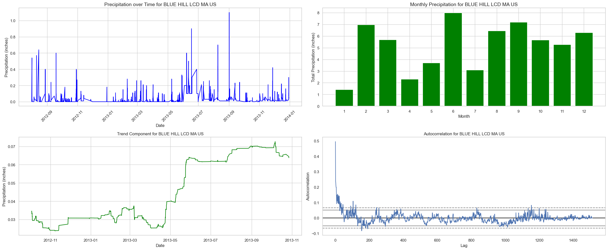

## **Week 2/17 - 2/23**
## 2/21/2025, Melina Garza
- Collecting data and doing an initial analysis of it. Focusing on real-estate sector initially.
- Data found: 
    - financial/stock data: [Yahoo Finance API](https://rapidapi.com/sparior/api/yahoo-finance15)

    - housing data: [Zillow Housing Data](https://www.zillow.com/research/data/)
    - flood data: [Flood events 1985-2016](https://floodobservatory.colorado.edu/Archives/index.html)
    - weather data: [NCEI US Climate Data (1992-2021)](https://www.kaggle.com/datasets/nachiketkamod/weather-dataset-us/data)
- Started programmtic analysis in `src/initial_analysis.py`

## 2/23/2025, Dhwani Sreenivas
- Trying to find data on housing prices over time in different regions of the US, as well as potentially looking at the housing assets that large companies own to be able to predict how their stock prices will be affected
- Data found:
    - housing price index data (1991 - 2024): [Federal Housing Finance Agency](https://www.fhfa.gov/data/hpi/datasets?tab=regional-hpi)
    - investigating company asset data (need demo): [Sovereign Wealth Fund Institute](https://www.swfinstitute.org/fund-rankings/real-estate-company)
- Drew diagram mapping our initial hypothesis/abstract


## **Week 2/24 - 3/2**
## 2/28/2025, Melina Garza
This week's focus is exploring different weather prediction methods and natural disaster prediction methods. Also took a snapshot of the weather data and exploring how to use Google Cloud to run models.

**Weather Data:**

Columns


**Weather Prediction Methods:**

Going to test these out for predicting rainfall (eventually use to predict floods):

1.  ARIMA (AutoRegressive Integrated Moving Average)
    - for short-term predicitons(daily/weekly)

2. LSTM 
    - for long-term rainfall trends/dependencies


**Disaster Prediction Methods:**

TBD

## 3/2/2025, Dhwani Sreenivas
- Focusing on 3 methods of weather forecasting, using rainfall data
- Current kaggle dataset's temporal resolution: daily, spatial resolution: 56950 unique weather stations seen in "precipitation_data_test.png"
- Kaggle dataset: 688 NaNs for precip in first 1000 entries
- Linearly interpolated the data (not best solution)

- Alternative data found:
    - rainfall data: [hourly rainfall 1900-2014](https://www.ncdc.noaa.gov/cdo-web/search?datasetid=PRECIP_HLY#)
    - time based resolution: available in 15 minute increments and hourly increments (hourly sample uploaded)
    - spatial resolution: available by zip codes, cities, states, countries in the US

    - aggregating this data: TBD


## **Week 3/3 - 3/9**
## 3/4/2025, Melina Garza
This week's focus is exploring different weather prediction methods using different models.

**DATA**(for Massachuseets only, eventually will explore other areas): `src/precipitation_data.csv`

**CODE:** `src/ml_climate_precipitation_prediction.ipynb`
- note: ran code in google colab, kept on getting issues locally with libraries

[COLUMNS:](https://www.ncei.noaa.gov/pub/data/cdo/documentation/PRECIP_HLY_documentation.pdf)
`STATION,STATION_NAME,ELEVATION,LATITUDE,LONGITUDE,DATE,HPCP,Measurement Flag,Quality Flag`

**HPCP:** The amount of precipitation recorded at the station for the hour ending at the
time specified for DATE above given in hundredths of inches or tenths of millimeters
depending on user’s specification of standard or metric units. The values 99999 means
the data value is missing. Hours with no precipitation are not shown.

**STEPS**
* **1  Clean the data:  `preprocess_for_ml()`**
* 2   Create plots for each station(for visualiaztion of data, commented out when running entire pipeline): `plot_per_station()`

    - 1.  precipitation over time: raw-time series data
    - 2. monthly precipitation: seasonal trends, cyclical patterns
    - 3. seasonal decomposition: isolates trend, seasonal, and residual components
    - 4. autocorrelation: relationships between past and future values, for models like ARIMA and LSTM

    Example for Blue Hill LCD MA Station:

    
    
    

* **3 Lag Features:** capture temporal dependencies(past values of a variable used as input features to predict future values): `add_lag_features()`

* **4 Modeling**
    - **Regression for Precipitation Prediction**: Decision Trees & XGBoost Models are used to predict the amount of precipitation
    - **Classification**: binary classification to predict whether the precipitaiton exceeds a certain threshold(e.g. 0.3 inches), indicating heavy rain


* **5 RESULTS:**
    1) Without elevation as a feature

        
       
        
    2) With elevation as a feature

          
    

* **6 Analysis/Next Steps**

    **Summary of Results**

     Positive

    - Best Performance: XGBoost achieves the lowest Mean Squared Error (MSE) for both regression tasks, outperforming Decision Trees.
    - High Accuracy in Classification: The classification model shows very high overall accuracy (~98%). However, this is misleading due to class imbalance. The model performs well on predicting the majority class (no heavy rain) but struggles with the minority class (heavy rain).

    Negative

    - Elevation: Adding elevation data doesn’t significantly improve the model. In fact, it slightly worsens the performance of the Decision Tree model.
    - Heavy Rain Prediction Performance:
        - Low Recall Without Elevation: Recall for heavy rain (class 1) is very low (~8%), meaning the model misses most heavy rain events. This is a critical issue for practical prediction. Precision for class 1 is also low (~31%), suggesting that when the model predicts heavy rain, it is often incorrect.
        - Low Recall With Elevation: The addition of elevation does not significantly improve the recall for heavy rain, and the model still fails to identify most heavy rain events.
        

    **Next Steps**

    Address Class Imbalance:

    - **Resampling**: Use SMOTE or random oversampling to balance the training set by increasing heavy rain examples, helping the model better learn the minority class.
    - **Class Weights**: Adjust XGBoost’s `scale_pos_weight` parameter to give more importance to the minority class (heavy rain).
    - **Threshold Adjustment**: Lower the classification threshold for heavy rain to improve recall, at the cost of higher false positives.

    More Modeling Techniques:

    - **Neural Networks**: Try deep learning models like (multi-layer perceptrons) MLPs or LSTMs to capture complex temporal patterns in precipitation data.
    - **Ensemble Methods**: Explore Random Forests or LightGBM for more robust, accurate models that can capture complex relationships.


## **Week 3/10 - 3/16**
## 3/11/2025, Melina Garza

Trying to improve precipitation prediction methods. Tried the following:

Code: added to `src/ml_climate_precipitation_prediction.ipynb`

\
**Resampling: SMOTE(Synthetic Minority Over-sampling Technique)** for classification XGBoost

- Code: `classify_heavy_rain_xgb()`

- Results:
  
  - Slight decrease in precision, but large improvement in recall. Will consider to use in future improvements.

**Class weights** for classification XGBoost

- Code: `classify_heavy_rain_xgb()`

- Results:

    -   Huge decrease in precision and huge increase in recall, meaning too many false positives(correctly identifying more rain events, but falsely predicting more non-heavy rain events). Not desirable.

\
**Ensemble Methods: Random Forest Classifier** 

- Code: added function `classify_heavy_rain_random_forest()` 

- Results:
    - Without optimized parameters
        - threshold: 0.3  
        - Similar to XGBoost results, needs improvement in both precision and recall
    - Used `GridSearchCV()` to find the best parameters:
        ```
        Random Forests for Heavy Rain Prediction...
        Best hyperparameters: {'max_depth': 10, 'min_samples_leaf': 2, 'min_samples_split': 10, 'n_estimators': 100}
        ```
 
    - With optimized parameters
         - threshold: 0.3  
         - Better balance between recall and precision, but they both need to be much higher.


    - Overall: not much improvement in precision for minority class(predicting heavy rain) but acheived better balance between precision and recall compared to XGBoost.


\
**Random Forest Regressor: predicting actual continuous HPCP value**
- Code: added function `precipitation_random_forest_regressor()` 

- Results
    - Best hyperparameters found using `RandomizedSearchCV`: ```{'n_estimators': 200, 'min_samples_split': 5, 'min_samples_leaf': 1, 'max_features': 'sqrt', 'max_depth': 10, 'bootstrap': True}```
    - 

    - Next steps: try to improve the R-squared value, seems to struggle to predict outliers.

\
**Finding additional dataset**
- Find another dataset, add more features like temp., humidity, wind speed, etc.
- Use: https://www.ncdc.noaa.gov/cdo-web/ to find data(site has been unresponsive lately)
- Found normals hourly dataset for two MA stations in 2010(couldn't get more years nor more stations): `src/2010_weather_MA.csv`
- Combined overlapping data from: `src/2010_weather_MA.csv` and `src/precipitation_data.csv` into `combined_weather_precipitation.csv`
    - **New columns:([documentation](https://www.ncei.noaa.gov/data/normals-hourly/doc/NORMAL_HLY_documentation.pdf))** 
    HLY-CLOD-PCTCLR(Clouds clear percentage),HLY-CLOD-PCTOVC(Clouds overcast percentage),HLY-DEWP-NORMAL(Dew point mean),HLY-HIDX-NORMAL(Heat index mean),HLY-TEMP-NORMAL(Temperature mean),HLY-WIND-AVGSP(Average wind speed),HLY-WIND-VCTDIR(Mean wind vector direction),HLY-WIND-VCTSPD(Mean wind vector magnitude)

\
**Testing Previous Methods with New Combined Data**
### XGBoost (note: removed class weights)


### Random Forest Classifier(heavy rain or not)


### Random Forest Regressor(predicting actual continuous HPCP value)


\
**Neural Network**